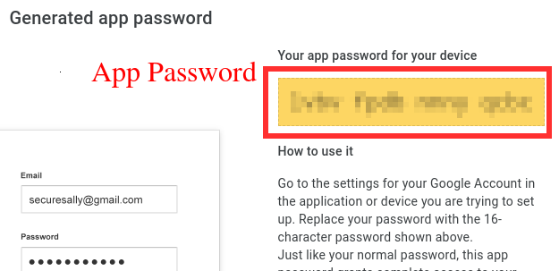
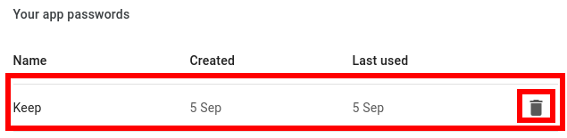

# Google Keep notes backup

This Python scripts allos to backup your Google Keep notes to local text files.

## Installation

This will install gkeepapi Python library:

    $ pip install -r requirements.txt

## How to setup

* Go to ["App passwords"](https://myaccount.google.com/apppasswords) in your Google account settings

* Select app -> "Other (custom name)":    **Keep**

## Usage

    $ ./gkeep.py -h

    usage: gkeep.py [-h] [--username USERNAME] [--password PASSWORD] [--token TOKEN]
                [--directory DIRECTORY] [--dry-run]

    Backup your Google Keep notes to local text files
    
    optional arguments:
      -h, --help            show this help message and exit
      --username USERNAME   You Google account username
      --password PASSWORD   Password to use for login
      --token TOKEN         Token to use for login
      --directory DIRECTORY
                            Local directory where to save downloaded notes files
                            (default: ./notes/)
      --dry-run, -n         Don't write files, just list the notes

## Example run

    $ ./gkeep.py --user john.doe --pass ....[AppPassword].... -n
    Token is:
    ....[TOKEN]....

    Note 1
    Note 2
    Note 3

    $ ./gkeep.py --username john.doe --token ....[TOKEN]....
    Note 1
    Note 2
    Note 3

    $ ls -l notes/
    'Note 1.txt'
    'Note 2.txt'
    'Note 3.txt'

## Clean up

Make sure to delete the app password in Google account settings when no longer required:

